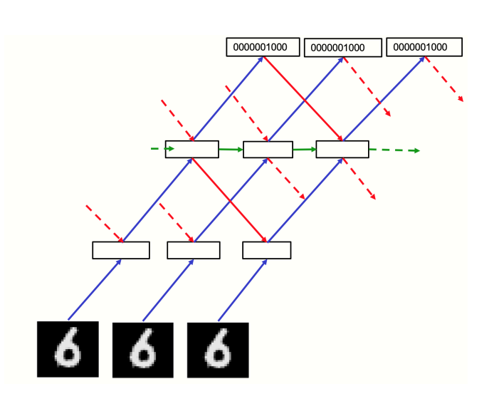

# Recurrent Forward Forward Network


[](https://www.gnu.org/licenses/gpl-3.0)

The implementation of the Recurrent Forward Forward Network is based on the [following paper](https://arxiv.org/abs/2212.13345). A three layer implementation of this network is benchmarked on MNIST achieving a 98%+ test accuracy with 3 layers of 2000 neurons.

This network differs from the paper in that:
1. It inverts the objective function to be more biologically plausible, and to show more similarity with predictive coding.
2. It hides the label for the first few timesteps, playing into the concept of predictive coding. (i.e. high activations initially, followed by low activations in case of successfully predicted samples)
3. It was unclear if Hinton actually implemented the recurrent connections, as the network diagram he provided was copied from his GLOM paper. But I did implement these connections here.

Here is the architecture diagram from the original paper, which is what I have implemented:


## Usage

```
pip install -e .
python -m RecurrentFF.benchmarks.mnist.mnist
```

## Model TODO:
- [x] Recurrent connections
- [x] Lateral connections
- [x] Data and label inputs conducive to changing accross timesteps
- [x] Dynamic negative data
- [x] Invert objective function: low activations for positive data

## Potential Additions:
- [ ] Receptive fields
- [ ] Fast weights
- [ ] Peer normalization
- [ ] Non-differentiable black boxes within network?
- [ ] Support data manipulation for positive data (i.e. transforms)
- [ ] Generative circuit
- [ ] Support data reconstruction
- [ ] Support negative data synthesis

## Benchmark TODO:

- [x] Benchmark on MNIST
- [x] Benchmark on Moving MNIST
- [x] Benchmark on Seq MNIST

## Contributing:

Please see [the contributing guide](CONTRIBUTING.md) for guidance.
